# Entity Relationship Diagram (ERD) - ARSeNAL

## Overview
ARSeNAL menggunakan **2 database** dengan peran yang berbeda:
- **PostgreSQL**: User management, ticketing, alerts, dan data transaksional
- **ClickHouse**: Analytics, predictions, dan data time-series berskala besar

---

## 1. PostgreSQL Database (Transactional)

### Diagram ERD (Mermaid)



```mermaid
erDiagram
    %% ========== USER MANAGEMENT ==========
    User {
        uuid id PK
        string email UK
        string name
        string fullname
        string password
        enum role
        boolean isActive
        datetime lastLogin
        datetime createdAt
        datetime updatedAt
    }

    %% ========== SITE MANAGEMENT ==========
    Site {
        uuid id PK
        string siteId UK
        string siteName
        string region
        float latitude
        float longitude
        float capacity
        enum tier
        string topology
        boolean isActive
        float rectifierCapacity
        int acUnits
        string acType
        string coolingSystem
        boolean hasGenset
        string climateZone
        string locationType
        float altitude
        string pricingType
        datetime createdAt
        datetime updatedAt
    }

    %% ========== POWER USAGE ==========
    PowerUsage {
        uuid id PK
        string siteId FK
        datetime date
        float consumptionKwh
        float billingAmount
        float predictedConsumption
        float predictedBilling
        float deviation
        float deviationPercentage
        float amrReading
        datetime amrTimestamp
        float trafficVolume
        float payload
        datetime createdAt
        datetime updatedAt
    }

    ClusteringResult {
        uuid id PK
        string usageId FK
        int clusterId
        string clusterName
        float efficiencyScore
        string recommendation
        string modelVersion
        datetime createdAt
    }

    %% ========== SETTLEMENT ==========
    Settlement {
        uuid id PK
        string siteId FK
        string isrNumber
        string isrStatus
        datetime isrExpiryDate
        float frequency
        float txPower
        float bandwidth
        float distance
        float rentFee
        string settlementStatus
        string detectionResult
        string detectionReason
        float potentialSavings
        string nmsStatus
        float nmsTxPower
        float nmsFrequency
        float nmsThroughput
        datetime createdAt
        datetime updatedAt
    }

    %% ========== BACKUP PLACEMENT ==========
    BackupPlacement {
        uuid id PK
        string siteId FK
        float currentBatteryCapacity
        float currentGensetCapacity
        float currentRectifierSize
        float batterySOH
        float recommendedBatteryCapacity
        float recommendedGensetCapacity
        float recommendedRectifierSize
        string urgencyLevel
        float priorityScore
        float avgOutageFrequency
        float avgOutageDuration
        datetime lastOutageDate
        float predictedBackupDuration
        float riskScore
        string status
        datetime createdAt
        datetime updatedAt
    }

    %% ========== ALERT & ANOMALY ==========
    AnomalyAlert {
        uuid id PK
        string usageId FK
        string siteId
        enum type
        enum severity
        string title
        string description
        float detectedValue
        float expectedValue
        float threshold
        float deviationPercent
        enum status
        datetime acknowledgedAt
        string acknowledgedBy
        datetime resolvedAt
        string resolvedBy
        string resolution
        datetime createdAt
        datetime updatedAt
    }

    %% ========== TICKETING ==========
    Ticket {
        uuid id PK
        string ticketNumber UK
        string alertId UK
        string title
        string description
        enum priority
        enum status
        string assignedToId FK
        datetime assignedAt
        datetime slaDeadline
        enum slaStatus
        string resolution
        datetime resolvedAt
        datetime closedAt
        array tags
        string category
        datetime createdAt
        datetime updatedAt
    }

    TicketComment {
        uuid id PK
        string ticketId FK
        string userId
        string comment
        boolean isInternal
        datetime createdAt
        datetime updatedAt
    }

    TicketHistory {
        uuid id PK
        string ticketId FK
        string userId
        string action
        string fieldName
        string oldValue
        string newValue
        datetime createdAt
    }

    %% ========== NOTIFICATION ==========
    Notification {
        uuid id PK
        string userId FK
        string alertId FK
        enum type
        enum channel
        string title
        string message
        enum status
        datetime sentAt
        datetime readAt
        json metadata
        datetime createdAt
    }

    %% ========== CHATBOT ==========
    ChatLog {
        uuid id PK
        string userId FK
        string sessionId
        string question
        string response
        string intent
        float confidence
        datetime createdAt
    }

    %% ========== SYSTEM ==========
    SystemConfig {
        uuid id PK
        string key UK
        string value
        string description
        string category
        datetime createdAt
        datetime updatedAt
    }

    AuditLog {
        uuid id PK
        string userId
        string action
        string entity
        string entityId
        json changes
        string ipAddress
        string userAgent
        datetime createdAt
    }

    %% ========== RELATIONSHIPS ==========
    User ||--o{ Ticket : "assignedTo"
    User ||--o{ ChatLog : "has"
    User ||--o{ Notification : "receives"

    Site ||--o{ PowerUsage : "has"
    Site ||--o{ Settlement : "has"
    Site ||--o{ BackupPlacement : "has"

    PowerUsage ||--o{ ClusteringResult : "has"
    PowerUsage ||--o{ AnomalyAlert : "triggers"

    AnomalyAlert ||--o| Ticket : "creates"
    AnomalyAlert ||--o{ Notification : "sends"

    Ticket ||--o{ TicketComment : "has"
    Ticket ||--o{ TicketHistory : "has"
```

### Tabel PostgreSQL yang Digunakan Endpoint

| Table | Endpoint | Deskripsi |
|-------|----------|-----------|
| `users` | `/api/v1/auth/login`, `/api/v1/auth/azure-login` | Autentikasi user |
| `sites` | `/api/v1/dashboard/heatmap` (fallback) | Data site master |
| `tickets` | `/api/v1/tickets/*` | Manajemen tiket |
| `anomaly_alerts` | `/api/v1/alerts/*` | Alert anomali |
| `notifications` | `/api/v1/notifications/*` | Notifikasi user |

---

## 2. ClickHouse Database (Analytics)

### Diagram ERD (Mermaid)



```mermaid
erDiagram
    %% ========== SITE ATTRIBUTES ==========
    site_attributes {
        String site_id PK
        Float64 latitude
        Float64 longitude
        String area
        String regional
        String nop
        String site_name
        String provinsi
        String kabupaten_kota
        String kecamatan
        String kelurahan
        UInt32 total_cells_2g
        UInt32 total_cells_4g
        UInt32 total_cells_5g
        DateTime64 _updated_at
    }

    %% ========== KWH PREDICTIONS ==========
    kwh_predictions_v0 {
        String site_id PK
        UInt32 yearmonth PK
        Float64 predicted_kwh
        Float64 actual_kwh
        String daya_cluster
        String model_version
        Float64 shap_daya_va
        Float64 shap_total_traffic_erl
        Float64 shap_total_vlr_subs
        Float64 shap_total_payload_mbyte
        DateTime64 _created_at
    }

    %% ========== KWH PREDICTION FEATURES ==========
    kwh_prediction_features {
        String site_id PK
        UInt32 yearmonth PK
        Float64 daya_va
        Float64 total_payload_mbyte
        Float64 total_vlr_subs
        UInt8 site_simpul_encoded
        UInt32 active_cells_2g
        UInt32 active_cells_4g
        UInt32 active_cells_5g
        Float64 bandwidth_2g
        Float64 bandwidth_4g
        Float64 bandwidth_5g
        UInt32 total_active_cells
        Float64 total_bandwidth
        Float64 total_kwh
        String daya_cluster
        DateTime64 _updated_at
    }

    %% ========== MODEL REGISTRY ==========
    kwh_model_registry {
        String model_version PK
        String daya_cluster PK
        Float64 test_r2
        Float64 test_rmse
        Float64 test_mae
        Float64 test_mape
        UInt32 train_samples
        UInt32 test_samples
        DateTime64 _created_at
    }

    %% ========== RELATIONSHIPS ==========
    site_attributes ||--o{ kwh_predictions_v0 : "site_id"
    site_attributes ||--o{ kwh_prediction_features : "site_id"
    kwh_predictions_v0 }o--|| kwh_model_registry : "model_version, daya_cluster"
    kwh_prediction_features }o--|| kwh_predictions_v0 : "site_id, yearmonth"
```

### Tabel ClickHouse yang Digunakan Endpoint

| Table | Endpoint | Deskripsi |
|-------|----------|-----------|
| `gold.site_attributes` | `/api/v1/power-usage-billing/sites`, `/api/v1/power-usage-billing/filter-options`, `/api/v1/dashboard/heatmap` | Metadata lokasi site (provinsi, NOP, koordinat) |
| `gold.kwh_predictions_v0` | `/api/v1/power-usage-billing/sites`, `/api/v1/power-usage-billing/sites/{id}/monthly`, `/api/v1/power-usage-billing/periods`, `/api/v1/dashboard/heatmap` | Data prediksi vs aktual kWh bulanan |
| `gold.kwh_prediction_features` | `/api/v1/power-usage-billing/sites`, `/api/v1/analytics/*` | Fitur teknis site (daya, payload, cells, bandwidth) |
| `gold.kwh_model_registry` | `/api/v1/power-usage-billing/model-performance`, `/api/v1/analytics/model-performance` | Performa model ML (R², RMSE, MAE, MAPE) |

---

## 3. Relasi Antar Database

```
┌─────────────────────────────────────────────────────────────────────────────┐
│                              ARSeNAL System                                  │
├─────────────────────────────────────────────────────────────────────────────┤
│                                                                             │
│  ┌─────────────────────────┐         ┌─────────────────────────────────┐   │
│  │      PostgreSQL         │         │          ClickHouse             │   │
│  │   (Transactional DB)    │         │       (Analytics DB)            │   │
│  ├─────────────────────────┤         ├─────────────────────────────────┤   │
│  │                         │         │                                 │   │
│  │  ┌─────────────────┐    │         │  ┌───────────────────────────┐  │   │
│  │  │     users       │    │         │  │    gold.site_attributes   │  │   │
│  │  └─────────────────┘    │         │  └───────────────────────────┘  │   │
│  │          │              │         │              │                  │   │
│  │          ▼              │         │              ▼                  │   │
│  │  ┌─────────────────┐    │         │  ┌───────────────────────────┐  │   │
│  │  │    tickets      │    │         │  │  gold.kwh_predictions_v0  │  │   │
│  │  └─────────────────┘    │         │  └───────────────────────────┘  │   │
│  │          │              │         │              │                  │   │
│  │          ▼              │         │              ▼                  │   │
│  │  ┌─────────────────┐    │         │  ┌───────────────────────────┐  │   │
│  │  │ anomaly_alerts  │    │         │  │ gold.kwh_prediction_feat. │  │   │
│  │  └─────────────────┘    │         │  └───────────────────────────┘  │   │
│  │          │              │         │              │                  │   │
│  │          ▼              │         │              ▼                  │   │
│  │  ┌─────────────────┐    │         │  ┌───────────────────────────┐  │   │
│  │  │  notifications  │    │         │  │  gold.kwh_model_registry  │  │   │
│  │  └─────────────────┘    │         │  └───────────────────────────┘  │   │
│  │                         │         │                                 │   │
│  └─────────────────────────┘         └─────────────────────────────────┘   │
│                                                                             │
│  ┌──────────────────────────────────────────────────────────────────────┐  │
│  │                        Logical Connection                             │  │
│  │  PostgreSQL.sites.siteId  ←──────→  ClickHouse.site_attributes.site_id│  │
│  │  (Master data reference, not physical FK)                            │  │
│  └──────────────────────────────────────────────────────────────────────┘  │
│                                                                             │
└─────────────────────────────────────────────────────────────────────────────┘
```

---

## 4. Detail Kolom per Tabel (ClickHouse)

### 4.1 `gold.site_attributes`
| Kolom | Tipe | Deskripsi |
|-------|------|-----------|
| `site_id` | String | ID unik site (PK) |
| `latitude` | Float64 | Koordinat latitude |
| `longitude` | Float64 | Koordinat longitude |
| `area` | String | Area coverage |
| `regional` | String | Regional (legacy) |
| `nop` | String | Network Operation Point |
| `site_name` | String | Nama site |
| `provinsi` | String | Provinsi lokasi |
| `kabupaten_kota` | String | Kabupaten/Kota |
| `kecamatan` | String | Kecamatan |
| `kelurahan` | String | Kelurahan |
| `total_cells_2g` | UInt32 | Jumlah cell 2G |
| `total_cells_4g` | UInt32 | Jumlah cell 4G |
| `total_cells_5g` | UInt32 | Jumlah cell 5G |
| `_updated_at` | DateTime64 | Timestamp update |

### 4.2 `gold.kwh_predictions_v0`
| Kolom | Tipe | Deskripsi |
|-------|------|-----------|
| `site_id` | String | ID site (PK) |
| `yearmonth` | UInt32 | Periode YYYYMM (PK) |
| `predicted_kwh` | Float64 | Prediksi konsumsi kWh |
| `actual_kwh` | Float64 | Konsumsi aktual kWh |
| `daya_cluster` | String | Cluster berdasarkan daya |
| `model_version` | String | Versi model ML |
| `shap_*` | Float64 | SHAP values untuk explainability |
| `_created_at` | DateTime64 | Timestamp pembuatan |

### 4.3 `gold.kwh_prediction_features`
| Kolom | Tipe | Deskripsi |
|-------|------|-----------|
| `site_id` | String | ID site (PK) |
| `yearmonth` | UInt32 | Periode YYYYMM (PK) |
| `daya_va` | Float64 | Kapasitas daya (VA) |
| `total_payload_mbyte` | Float64 | Total payload (MB) |
| `total_vlr_subs` | Float64 | Total VLR subscribers |
| `site_simpul_encoded` | UInt8 | Flag site simpul |
| `active_cells_*` | UInt32 | Jumlah cell aktif per teknologi |
| `bandwidth_*` | Float64 | Bandwidth per teknologi |
| `total_active_cells` | UInt32 | Total cell aktif |
| `total_bandwidth` | Float64 | Total bandwidth |
| `total_kwh` | Float64 | Total kWh (historical) |
| `daya_cluster` | String | Cluster daya |

### 4.4 `gold.kwh_model_registry`
| Kolom | Tipe | Deskripsi |
|-------|------|-----------|
| `model_version` | String | Versi model (PK) |
| `daya_cluster` | String | Cluster daya (PK) |
| `test_r2` | Float64 | R² score |
| `test_rmse` | Float64 | Root Mean Square Error |
| `test_mae` | Float64 | Mean Absolute Error |
| `test_mape` | Float64 | Mean Absolute Percentage Error |
| `train_samples` | UInt32 | Jumlah sample training |
| `test_samples` | UInt32 | Jumlah sample testing |
| `_created_at` | DateTime64 | Timestamp pembuatan |

---

## 5. Ringkasan Endpoint vs Database

| Page | Endpoint | PostgreSQL | ClickHouse |
|------|----------|------------|------------|
| `/login` | `POST /auth/login` | ✅ `users` | - |
| `/login` | `POST /auth/azure-login` | ✅ `users` | - |
| `/power-usage-billing` | `GET /power-usage-billing/sites` | - | ✅ `kwh_predictions_v0`, `site_attributes`, `kwh_prediction_features` |
| `/power-usage-billing` | `GET /power-usage-billing/filter-options` | - | ✅ `kwh_predictions_v0`, `site_attributes` |
| `/power-usage-billing` | `GET /power-usage-billing/periods` | - | ✅ `kwh_predictions_v0` |
| `/power-usage-billing` | `GET /power-usage-billing/summary` | - | ✅ `kwh_predictions_v0`, `site_attributes`, `kwh_prediction_features` |
| `/power-usage-billing` | `GET /power-usage-billing/model-performance` | - | ✅ `kwh_model_registry` |
| `/power-usage-billing/[id]` | `GET /power-usage-billing/sites/{id}/monthly` | - | ✅ `kwh_predictions_v0` |
| `/dashboard` | `GET /dashboard/heatmap` | - | ✅ `kwh_predictions_v0`, `site_attributes` |

---

*Dokumen ini di-generate pada: Maret 2026*
*Project: ARSeNAL - Telkomsel Network Analytics*
